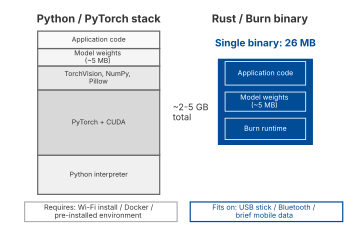

# 1. Introduction

## 1.1 Context and Motivation

Shipping a machine learning model outside of a cloud environment is still harder than most tutorials suggest. The standard ML stack, Python and PyTorch, is built for research flexibility and GPU throughput. It is less suited for running on a phone or on a field laptop that may not have an internet connection. A typical PyTorch deployment needs the Python interpreter, the PyTorch library and a set of supporting packages. Together, these can take several gigabytes on the target device. That is acceptable on a cloud server, but it quickly becomes a problem for practical edge scenarios.

Rust offers a different deployment model. It compiles to a single binary with no interpreter and no garbage collector. Its type system catches many problems at compile time, which is useful for ML processes that have to run reliably. The build system also supports cross-compilation to ARM, iOS, Android and WebAssembly. In this project, that means the deployment can go from a multi-gigabyte Python environment to a 26 MB binary that can even be distributed on a USB stick.

The difficult part is training. Rust's ML ecosystem is still young, and many frameworks focus more on inference than on the full training loop. Semi-supervised learning (SSL) combines a small set of labeled data with a large pool of unlabeled data. To do that properly, the implementation needs pseudo-labeling, confidence filtering and repeated retraining cycles. This is more demanding than simple inference, and it tests whether the training API is mature enough. The central question of this thesis is whether Rust's ML ecosystem, and specifically the Burn framework, can support this workflow while still keeping the deployment advantages.

Plant disease detection is used here as the concrete benchmark. The PlantVillage dataset (38 disease classes, roughly 87,000 images) provides a realistic and well-understood test case. Plant disease detection is also a natural fit for edge deployment: the people who need it most often work in areas with limited connectivity, and the diagnostic tools that are currently available either depend on cloud access or require expensive laboratory analysis. By building the SSL pipeline for this specific problem, the thesis tests whether Rust can handle a full ML workflow, from training to deployment, in a domain where offline operation really matters.

*Figure 1.1: Conceptual comparison of the runtime footprint of a Python/PyTorch deployment versus a compiled Rust binary. The sizes are based on the measurements described in Chapter 3.*

## 1.2 The Labeling Problem

Any image classification model needs labeled training data, and expert annotation is expensive. In the agricultural domain, having a plant pathologist label images requires specialized expertise and is both time-consuming and costly [2]. For a dataset of 50,000 images across 38 classes, the total annotation budget can easily reach tens of thousands of euros, which is too expensive for many projects.

Semi-supervised learning offers a way to reduce that cost. By training an initial model on a small labeled subset and then using that model to generate pseudo-labels for the remaining unlabeled data, SSL can approach the accuracy of fully supervised training at a fraction of the annotation budget. The challenge is making sure that the pseudo-labels are accurate enough to improve the model rather than degrade it, which comes down to careful confidence thresholding and retraining design.

## 1.3 Research Question

The central research question of this thesis is:

> **How can a semi-supervised neural network be efficiently implemented in Rust for the automatic labeling of partially labeled datasets on an edge device?**

This question is broken down into the following sub-questions:

1. Which principles underpin semi-supervised learning, and how can pseudo-labeling be applied to image classification?
2. What is the best-practice approach for implementing neural networks with the Burn framework in Rust?
3. How can data augmentation and pseudo-labeling strategies improve training efficiency on limited labeled datasets?
4. What trade-offs exist between model accuracy, inference latency and deployment size on edge hardware?
5. How does a Burn-based semi-supervised model compare to a PyTorch equivalent on identical hardware?
6. How much labeled data is needed for acceptable accuracy, and what happens when new classes are added incrementally?
7. Which practical obstacles stand in the way of deploying Rust-based ML on edge devices?

## 1.4 Scope and Approach

The research focuses on implementing a complete SSL pipeline in Rust with the Burn framework, validated on the PlantVillage dataset with 38 disease classes and roughly 87,000 images. The model is a custom lightweight convolutional neural network (CNN) designed for edge deployment. It is not a pretrained model and not a Vision Transformer. The full pipeline, from training to deployment, compiles into a single binary that runs fully offline.

The experimental work is organised around three axes:

1. **Label efficiency**: determining the minimum number of labeled samples per class that is needed for acceptable classification accuracy.
2. **Class scaling**: measuring how catastrophic forgetting changes when new classes are added to models of different sizes (a 5-class base versus a 30-class base).
3. **New class position**: evaluating whether a new class is harder to learn as the 6th class in a small taxonomy than as the 31st class in a large one.

Deployment is validated across four hardware configurations: a laptop with an NVIDIA RTX 3060 GPU, an iPhone 12 through Tauri, a Jetson Orin Nano and a CPU-only environment.

## 1.5 Thesis Structure

This thesis is organised as follows:

- **Chapter 2: Research** presents the literature study. It covers semi-supervised learning techniques, the Rust ML ecosystem, incremental learning theory, edge AI deployment strategies and the PlantVillage dataset.
- **Chapter 3: Research Results** describes the technical implementation. It covers the system architecture, the SSL training pipeline, the three controlled experiments and their quantitative results, the cross-platform benchmarks and the Tauri-based GUI application.
- **Chapter 4: Reflection** offers a critical evaluation of the results through interviews with external experts, together with an analysis of the broader implications, including implementation barriers, privacy benefits and possible directions for future research.
- **Chapter 5: Advice** gives a practical, step-by-step guide for anyone tackling the same research question, grounded in both the experimental findings and the planned external feedback.
- **Chapter 6: Conclusion** answers the research question directly by bringing together the key findings from the preceding chapters.
