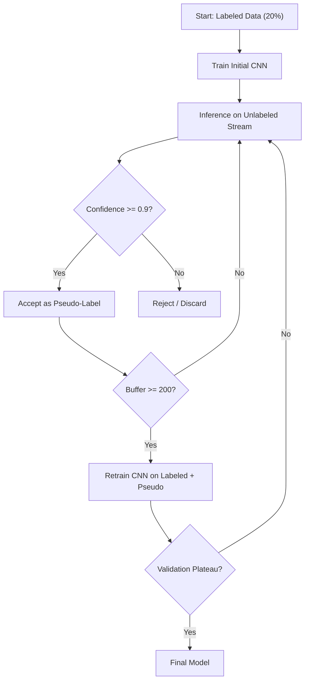

# 2. Research: Literature Study

This chapter sets out the theoretical background that is needed to understand the research and its results. In line with the thesis guidelines, only topics that fall **outside the standard MCT curriculum** are discussed in depth; the intended audience consists of IT professionals. The chapter covers semi-supervised learning theory, the Rust machine learning ecosystem, incremental learning (catastrophic forgetting), edge AI deployment, and the PlantVillage dataset.

## 2.1 Semi-Supervised Learning

### 2.1.1 Fundamentals

Semi-supervised learning (SSL) sits between supervised learning, where every data point is labeled, and unsupervised learning, where there are no labels at all. SSL combines a small set of labeled examples with a large pool of unlabeled data to train a model that performs comparably to one trained on a fully labeled dataset [13]. This is particularly valuable in domains where labeling is expensive, and agricultural image annotation by plant pathologists is a clear example of such a domain.

The core assumption behind SSL is the **cluster assumption**: data points that lie close together in feature space are likely to share the same label. When that assumption holds, the structure of the unlabeled data provides useful information about where the decision boundary should run [13].

### 2.1.2 Pseudo-Labeling

Pseudo-labeling is one of the simplest and most effective SSL techniques. The process works as follows:

1. Train a model on the labeled subset.
2. Use the model to predict labels for the unlabeled data.
3. Accept predictions that exceed a confidence threshold as pseudo-labels.
4. Retrain the model on the combined labeled and pseudo-labeled data.
5. Repeat until convergence.

The critical design choice here is the **confidence threshold**. A threshold that is set too low admits noisy pseudo-labels that can degrade the model's performance, a phenomenon that is commonly referred to as confirmation bias. A threshold that is set too high discards too many samples and limits the benefit that can be extracted from the unlabeled data. This is the **quantity to quality trade-off** described by Chen et al. in SoftMatch [13], which proposes an adaptive weighting scheme to balance both concerns.

### 2.1.3 Related Work in Plant Disease Classification

Several recent studies have applied SSL to plant disease detection with good results:

**Ambiguity-Aware Semi-Supervised Learning (AaSSL).** Pham et al. (2025) address the problem of ambiguous samples near the decision boundary. Their method explicitly filters these samples out rather than accepting them as pseudo-labels. With only 5% of the data labeled, accuracy improved from 90.74% to 94.09% [1]. This idea directly influenced the confidence-threshold filtering used in this project.

**Mean Teacher and Consistency Regularization.** Ilsever and Baz (2024) apply a student–teacher architecture to the PlantVillage dataset. The teacher's weights are an exponential moving average (EMA) of the student's weights, and a consistency loss is applied under different augmentations. That approach reached 88.50% accuracy with 5% labeled data [4]. It is effective, but the Mean Teacher approach requires two models to be held in memory at the same time, which is a real constraint on edge devices with limited VRAM.

**Semi-supervised jute leaf disease classification.** Jannat (2025) shows that a lightweight CNN combined with SSL on 10% labeled and 90% unlabeled data can reach 97.89% accuracy, specifically with mobile and edge deployment in mind [2]. This result supports the broader idea that simple architectures paired with effective SSL can outperform more complex models in constrained environments.

**Self-supervised pretraining.** Wang et al. (2024) show that self-supervised pretraining using Masked Autoencoders (MAE) and attention mechanisms such as CBAM can improve feature extractors for downstream classification with limited labels [5]. That approach falls outside the scope of the current project, but it is a promising direction for future work.

### 2.1.4 The Pseudo-Labeling Pipeline Design

Based on the literature review, the following design decisions were taken for this project's SSL pipeline:


*Figure 2.1: Flowchart of the implemented pseudo-labeling pipeline.*

1. **A single model** rather than a student–teacher setup (keeps the VRAM usage within edge device limits).
2. **A high confidence threshold (0.9)** to prioritise label precision over recall, following the ambiguity-aware filtering principle from Pham et al.
3. **A retrain threshold of 200 samples** to batch pseudo-labels together rather than adding them one at a time, which reduces the overhead of retraining.
4. **Label-consistent augmentations** (random crop, horizontal flip, brightness jitter): augmentations that do not alter the semantic content of the image.

## 2.2 The Rust ML Ecosystem: Burn Framework

### 2.2.1 Why Rust for Machine Learning?

The standard ML stack (Python, PyTorch, CUDA) is optimised for research flexibility and GPU throughput. For edge deployment, however, it runs into several issues:

- **Deployment size.** Running a PyTorch model requires the Python interpreter, the PyTorch library and a number of supporting packages on the target device. A CUDA-enabled PyTorch wheel on its own is in the low gigabytes once unpacked; the full environment grows further once TorchVision, NumPy and tooling are added [17][23]. That is comparable in scale to a Rust `target/` build directory (around 2 GB), but unlike Rust, Python has no way to distill that into a single small binary for distribution.
- **Startup latency.** Python interpreter initialisation takes about 3 seconds, which is very noticeable in interactive applications.
- **Cross-compilation.** Deploying Python ML models to iOS, Android or embedded ARM devices requires wrapper frameworks (CoreML, TFLite, ONNX Runtime) and format conversion steps.
- **Memory safety.** Python's garbage collector and the C++ backend (LibTorch) can cause unpredictable memory behaviour, which is problematic for long-running processes on an edge device.

Rust addresses all of these constraints. It compiles to a single static binary with no runtime dependencies. Its ownership model guarantees memory safety at compile time without a garbage collector. And its build system (Cargo) supports cross-compilation to ARM, WASM, iOS and Android targets out of the box [12].

### 2.2.2 Framework Comparison

Three Rust ML frameworks were evaluated for this project [14]:

**Table 2.1:** Comparison of Rust ML frameworks

| Criterion | Burn | Candle | tch-rs |
|:---|:---|:---|:---|
| **Primary focus** | Training & inference (flexible) | Inference (LLM/serverless) | PyTorch bindings (full feature set) |
| **Backend** | Agnostic (wgpu, CUDA, CPU, WASM) | CUDA, CPU, WASM | LibTorch (C++) |
| **Training API** | Extensive, custom loops | Limited | Full (PyTorch-style) |
| **Deployment** | Static binary | Static binary / WASM | Requires LibTorch shared library |
| **Edge suitability** | High (no heavy dependencies) | High (lightweight) | Medium (complex cross-compilation) |

**Burn** [6][7] is a backend-agnostic framework with a comprehensive training API that supports custom training loops, which is exactly what is needed to implement a pseudo-labeling cycle. Its `Module` derive macro allows for type-safe model definitions that are generic over backends, so the same code compiles against CUDA, CPU, wgpu or WASM targets without any modification.

**Candle**, developed by Hugging Face, is strong at inference for large language models and transformer architectures. Its training API, however, is more limited and does not comfortably support the iterative pseudo-labeling loops that SSL relies on.

**tch-rs** provides direct Rust bindings to LibTorch, which is PyTorch's C++ backend. That gives full PyTorch compatibility, but it also reintroduces the dependency on a large C++ shared library (around 1.5 GB), which undoes the deployment size advantage of Rust.

**Conclusion:** Burn was selected for its combination of backend-agnostic deployment, an extensive training API that is suitable for custom SSL loops, and the ability to produce a self-contained static binary for edge devices [8][9][10].

### 2.2.3 Burn's Backend Abstraction

A distinctive feature of Burn is its backend abstraction layer. Models are defined as generic structs parameterised over a `Backend` trait:

```rust
impl<B: Backend> PlantClassifier<B> {
    pub fn forward(&self, x: Tensor<B, 4>) -> Tensor<B, 2> {
        // Identical code regardless of backend
    }
}
```

At compile time, the concrete backend is selected through feature flags. This means:
- `burn-cuda` for NVIDIA GPU training and inference
- `burn-ndarray` for CPU-only environments
- `burn-wgpu` for cross-platform GPU (Vulkan, Metal, DX12, WebGPU)
- `burn-candle` as an alternative lightweight backend

The same trained model weights can be loaded on any of these backends, which enables a workflow where training happens on a desktop GPU and inference runs on a phone or an embedded device.

## 2.3 Incremental Learning and Catastrophic Forgetting

### 2.3.1 The Problem

In a real-world deployment, the set of plant diseases that the model has to recognise does not stay the same forever. New diseases emerge, new crop varieties are introduced and regional conditions change. A practical system must therefore be able to **add new classes** to an existing model without retraining from scratch on the entire dataset.

The main obstacle is **catastrophic forgetting**. When a neural network is fine-tuned on new data, it tends to overwrite the weights that encoded knowledge about the older data, which causes performance on the previously learned classes to degrade [18].

### 2.3.2 Mitigation Strategies

The literature describes three main families of approaches for dealing with catastrophic forgetting:

**Regularization-based methods** add a penalty term to the loss function that discourages large changes to weights that were important for previously learned tasks.

- **Elastic Weight Consolidation (EWC)** [19] uses the Fisher information matrix to estimate the importance of each weight for the earlier tasks. Important weights receive a larger penalty for modification during new-task training.
- **Learning without Forgetting (LwF)** [20] uses knowledge distillation: the model's predictions on new-task data are regularised to stay consistent with the outputs of the old model.

**Rehearsal-based methods** keep a small buffer of examples from previous tasks and replay them during new-task training.

- **Experience Replay** stores a fixed number of examples per class and includes them in every training batch.
- **Gradient Episodic Memory (GEM)** constrains the gradient updates so that the loss on stored examples does not increase.

**Architecture-based methods** allocate separate network capacity for each task.

- **Progressive Neural Networks** add new columns of neurons for each new task, with lateral connections to previous columns.
- **PackNet** prunes and freezes weights after each task, freeing up capacity for subsequent ones.

For this project, the experimental focus is on measuring the severity of catastrophic forgetting under different conditions (base model size, number of labeled samples) in order to establish empirical baselines. The implementation uses straightforward fine-tuning, which isolates the forgetting effect without the confounding variable of a mitigation strategy.

## 2.4 Edge AI Deployment

### 2.4.1 Constraints and Requirements

Edge deployment brings constraints that differ fundamentally from cloud or data-centre ML:

- **Compute:** GPU and CPU capability are limited, so models have to be small and efficient.
- **Memory:** typically 4 to 8 GB of RAM or VRAM, shared with the operating system and any other applications.
- **Storage:** the model and application have to be small enough to be installed over limited-bandwidth channels.
- **Connectivity:** zero network dependency during inference (fully offline).
- **Latency:** sub-second inference is required for interactive applications.

### 2.4.2 Deployment Formats

Several deployment paths exist for ML models on edge devices:

- **ONNX (Open Neural Network Exchange):** a vendor-neutral model format supported by ONNX Runtime, which has backends for CPU, GPU, CoreML (iOS), NNAPI (Android) and WebAssembly. It is widely used but always requires a conversion step from the training framework.
- **TensorFlow Lite (TFLite):** Google's edge inference runtime, optimised for mobile devices. It requires models to be converted from TensorFlow format and has limited support for custom operations.
- **WebAssembly (WASM):** allows ML models to run inside web browsers at near-native performance. It makes Progressive Web Apps (PWAs) possible and those can work fully offline after the first load.
- **Native compilation (Rust/C++):** compiling the model and the inference runtime into a single binary removes all dependency management entirely. That is the approach used in this project via Burn.

### 2.4.3 Tauri for Cross-Platform Deployment

Tauri [21] is a framework for building desktop and mobile applications with a Rust backend and a web-based frontend. Unlike Electron, which bundles a full Chromium browser, Tauri uses the operating system's native webview, and the resulting applications are therefore considerably smaller.

For this project, Tauri makes it possible to produce, from a single codebase:
- A desktop application (Linux, macOS, Windows) with native GPU access.
- An iOS application where the Rust Burn model runs directly on the Apple A-series chip.
- A potential Android application (Tauri Android support is still under active development).

The ML inference runs entirely in the Rust backend and is exposed to the Svelte 5 frontend through Tauri's inter-process communication (IPC) mechanism.

### 2.4.4 MicroFlow and Rust-Based Inference Engines

Zhang et al. (2024) present MicroFlow, an efficient Rust-based inference engine that is designed specifically for TinyML deployments [12]. MicroFlow shows that Rust's zero-cost abstractions and its lack of a garbage collector make it a realistic language for inference on microcontrollers with as little as 256 KB of RAM. This project targets more capable devices (smartphones, laptops), but MicroFlow validates the broader thesis that Rust is a viable language for production ML inference at the edge.

## 2.5 The PlantVillage Dataset

The PlantVillage dataset is one of the most widely used benchmarks for plant disease classification research. The version used in this project is the **New Plant Diseases Dataset** from Kaggle, which provides a pre-balanced and augmented collection of plant leaf images.

**Table 2.2:** Dataset characteristics

| Property | Value |
|:---|:---|
| Total images | ~87,000 |
| Classes | 38 (diseases + healthy) |
| Images per class | ~2,000 (pre-balanced) |
| Image format | JPEG, variable resolution |
| Pre-split | train (~70K) / valid (~17K) |
| Crops covered | Apple, Tomato, Grape, Corn, Potato, and others |

The dataset contains both diseased and healthy examples for each crop, so the model can learn to distinguish between different disease states and healthy tissue. Classes follow the naming convention `Crop___Disease` (for example `Apple___Apple_scab`, `Tomato___healthy`).

For this project, the existing train and valid split is merged and then re-split according to the four-pool strategy described in Chapter 3 (20% labeled, 60% stream, 10% validation, 10% test). This makes sure that the SSL pipeline has access to a large pool of unlabeled data while also keeping a held-out test set that is never seen during training.

Because the dataset is pre-balanced (roughly 2,000 images per class), the experimental setup is simplified: class imbalance cannot confound the results of the label efficiency and class scaling experiments.

### 2.5.2 Limitations of the Dataset

PlantVillage is widely used as a benchmark, but it has known limitations that are relevant here:

- **Controlled imaging conditions.** Images in PlantVillage were captured under relatively uniform lighting and backgrounds. Real-world field images contain varying lighting, complex backgrounds (soil, other plants, sky) and motion blur from handheld cameras.
- **Single disease per image.** Each PlantVillage image contains a single disease manifestation. In practice, plants may show multiple diseases at the same time, or disease symptoms may be confounded with nutrient deficiencies or mechanical damage.
- **Limited crop diversity.** The 38 classes cover the most common crops and diseases, but many region-specific diseases are not represented. A production system would need to be extended with locally relevant classes.
- **No temporal progression.** The dataset captures diseases at a single point in time. Early-stage detection, which is when intervention is most effective, calls for images of disease onset, and those are underrepresented.

These limitations do not invalidate the dataset for this research, but they define the boundary conditions under which the experimental results should be read. Field validation on real-world imagery (discussed in Chapter 4) remains essential before deployment.
