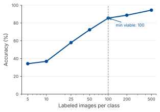
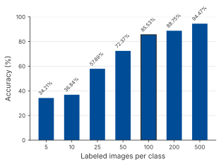
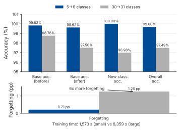
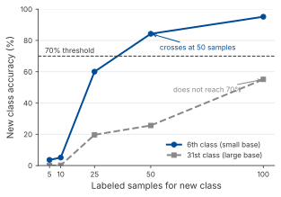
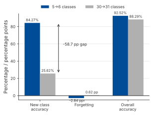
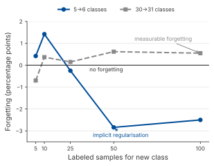
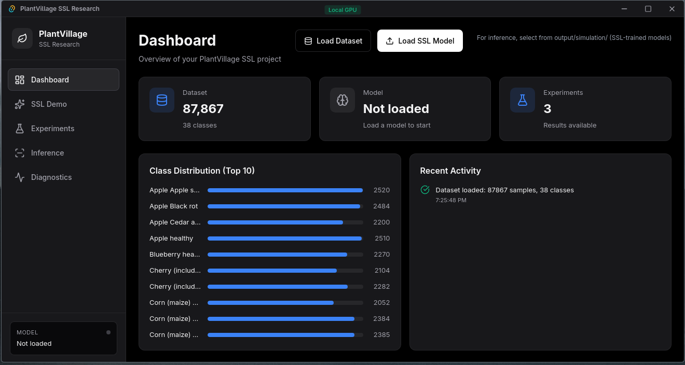

# 3. Research Results

This chapter describes the system that was built to answer the research question. It covers the architecture, the semi-supervised learning pipeline, three controlled experiments that matter for deployment, cross-platform benchmarks and the graphical user interface.

## 3.1 System Architecture

### 3.1.1 Project Structure

The project is organised as two separate Rust workspaces:

- **`plantvillage_ssl`**: the main SSL library and CLI, built on Burn 0.21. This workspace contains the CNN model, the training loop, the pseudo-labeling simulation pipeline, the experiment runner and the Tauri-based GUI application.
- **`incremental_learning`**: a dedicated workspace for the incremental learning experiments, built on Burn 0.21. It is split into library crates (`plant-core`, `plant-dataset`, `plant-training`, `plant-incremental`) and CLI tools (`train`, `evaluate`, `experiment-runner`).

The split into two workspaces was a deliberate choice. The incremental learning crate was developed earlier in the project and keeps the class-incremental experiments separate from the main SSL pipeline. Both workspaces share the same CNN architecture and dataset handling logic, so the experimental results remain comparable.

### 3.1.2 CNN Architecture

The model is a custom lightweight CNN with four convolutional blocks. It was designed to balance classification accuracy with the memory and compute limits of edge devices. The architecture is defined as follows:

```text
Conv2d(3, 32, 3×3)  → BatchNorm → ReLU → MaxPool(2×2)
Conv2d(32, 64, 3×3) → BatchNorm → ReLU → MaxPool(2×2)
Conv2d(64, 128, 3×3) → BatchNorm → ReLU → MaxPool(2×2)
Conv2d(128, 256, 3×3) → BatchNorm → ReLU → MaxPool(2×2)
AdaptiveAvgPool → Linear(256, 256) → ReLU → Dropout(0.3) → Linear(256, 38)
```

Input images are resized to 128×128 (or 256×256 in some experiments) RGB. The output layer produces 38 logits, one per PlantVillage class. The Burn implementation uses Rust's type system to make the model generic over backends. Each convolutional block wraps a Conv2d, BatchNorm, ReLU and optional MaxPool:

```rust
/// A CNN block with Conv2d, BatchNorm, ReLU, and optional MaxPool
#[derive(Module, Debug)]
pub struct ConvBlock<B: Backend> {
    pub conv: Conv2d<B>,
    pub bn: BatchNorm<B>,
    pub relu: Relu,
    pub pool: Option<MaxPool2d>,
}

impl<B: Backend> ConvBlock<B> {
    pub fn forward(&self, x: Tensor<B, 4>) -> Tensor<B, 4> {
        let x = self.conv.forward(x);
        let x = self.bn.forward(x);
        let x = self.relu.forward(x);
        match &self.pool {
            Some(pool) => pool.forward(x),
            None => x,
        }
    }
}
```

The classifier itself composes four of these blocks into the full architecture:

```rust
#[derive(Module, Debug)]
pub struct PlantClassifier<B: Backend> {
    pub conv1: ConvBlock<B>,
    pub conv2: ConvBlock<B>,
    pub conv3: ConvBlock<B>,
    pub conv4: ConvBlock<B>,
    pub global_pool: AdaptiveAvgPool2d,
    pub fc1: Linear<B>,
    pub dropout: Dropout,
    pub fc2: Linear<B>,
    num_classes: usize,
}
```

As a result, the same model code compiles for CUDA (for GPU-accelerated training) and ndarray (for CPU-only environments). Burn also supports a wgpu backend for cross-platform GPU inference, but that backend was not tested in this project.

### 3.1.3 Model Size

The trained model weights take up about 916 KB in Burn's native CompactRecorder format. The compiled Rust release binary, which includes the model, the inference runtime and the application code, is roughly 26 MB. The PyTorch checkpoint for the same CNN architecture is similar in size, only a few MB. **The model weights are simular in both of these stacks.**

The important difference is **what has to be present on the end user's device to run inference.** With Rust, the release binary is the only artefact that has to be there. It is a single 26 MB file that contains the compiled runtime and the dependencies. With Python, running the same model requires the Python interpreter, the PyTorch library, with or without CUDA support, and several extra packages. A CUDA-enabled PyTorch wheel alone is typically in the low gigabytes once unpacked [6][7], and a practical environment with TorchVision, NumPy, Pillow and similar packages grows further from there.

To put that in perspective, the Rust `target/` build directory, which is comparable to `node_modules` or a Python virtual environment, is itself around 2.1 GB. That is similar to a PyTorch virtual environment. **Both stacks require gigabytes of tooling during development.** The difference is that Rust's compilation step reduces all of that to a single portable binary, while a Python deployment has to carry its interpreter and library tree to the target device.

For edge deployment, this means that the Rust binary can be distributed over Bluetooth, on a USB stick or through a brief mobile data connection. A Python-based deployment either requires a multi-gigabyte environment to be pre-installed on every device or forces the team to ship a container or bundle that includes the interpreter and wheels.

## 3.2 Semi-Supervised Learning Pipeline

### 3.2.1 Data Split Strategy

The PlantVillage dataset (roughly 87,000 images across 38 classes) is split into four non-overlapping pools:

| Pool | Fraction | Purpose |
|:--|:--:|:--|
| Labeled (CNN) | 20% | Initial supervised training |
| Stream (SSL) | 60% | Unlabeled data for pseudo-labeling |
| Validation | 10% | Hyperparameter tuning and early stopping |
| Test | 10% | Final evaluation (never seen during training) |

The labeled ratio is intentionally kept low at 20%. This simulates a realistic situation where only a limited amount of expert-annotated data is available.

### 3.2.2 Training Pipeline

**Step 1: Initial supervised training.** The CNN is trained on the 20% labeled pool for 30 epochs using cross-entropy loss, the Adam optimizer and standard data augmentations (horizontal and vertical flip, rotation, brightness, contrast, saturation, blur and noise). This produces a baseline model with roughly 70 to 75% validation accuracy.

**Step 2: Pseudo-labeling simulation.** The trained model is then used to classify images from the 60% unlabeled stream pool. Images are processed in batches of 100, which are referred to as "images per day" in the streaming simulation. For every image, the model produces a softmax probability distribution over all 38 classes. If the maximum predicted probability is above the **confidence threshold of 0.9**, the image is accepted as a pseudo-labeled sample with the predicted class as its label. Images that fall below this threshold are discarded.

**Step 3: Retraining.** Once 200 pseudo-labeled samples have accumulated (the retrain threshold), the model is retrained on the union of the original labeled data and the accepted pseudo-labels. This cycle repeats until all stream data has been processed or validation accuracy plateaus.

The pipeline is exposed as a CLI command:

```bash
cargo run --release --no-default-features --features cuda \
    --bin plantvillage_ssl -- simulate \
    --model "output/models/plant_classifier_TIMESTAMP" \
    --data-dir "data/plantvillage" \
    --cuda --days 0 --labeled-ratio 0.2 \
    --retrain-threshold 200 --confidence-threshold 0.9
```

### 3.2.3 SSL Results

The saved checkpoints were re-evaluated with Burn 0.21.0 on the held-out test split using the CUDA backend. The evaluation used the same split configuration as the training pipeline: 20% labeled data, 60% stream data, 10% validation data and 10% test data. The test split contains 8,786 images and was not used during training or pseudo-label selection.

**Table 3.1:** Held-out test evaluation of saved checkpoints

| Model | Samples | Top-1 accuracy | Macro F1 |
|:---|---:|---:|---:|
| Supervised baseline | 8,786 | 86.06% | 86.08% |
| SSL checkpoint | 8,786 | 94.90% | 94.74% |

The saved SSL checkpoint improves held-out test accuracy by 8.84 percentage points and macro F1 by 8.66 percentage points compared with the saved supervised baseline. This supports the central SSL claim more strongly than the earlier validation-only wording, because the comparison is now made on the held-out test split. These values are still single-checkpoint results rather than averages over multiple random seeds.

## 3.3 Incremental Learning Experiments

Three controlled experiments were carried out to evaluate parts of the system that matter for real-world deployment: how much labeled data is actually needed, what happens when new classes have to be added to an existing model, and whether the difficulty of adding a class depends on the size of the existing taxonomy.

### 3.3.1 Experiment 1: Label Efficiency Curve

**Research question:** How many labeled images per class are needed for acceptable classification accuracy?

The model was trained from scratch at seven different labeled data quantities, ranging from 5 up to 500 images per class. All other variables (architecture, augmentation, training schedule) were kept constant.

**Table 3.2:** Label efficiency results

| Images per class | Accuracy (%) | Training time (s) |
|:--:|:--:|:--:|
| 5 | 34.21 | 25.6 |
| 10 | 36.84 | 22.5 |
| 25 | 57.89 | 54.4 |
| 50 | 72.37 | 109.0 |
| 100 | 85.53 | 219.9 |
| 200 | 88.75 | 439.1 |
| 500 | 94.47 | 1,101.1 |


*Figure 3.1: Accuracy as a function of labeled images per class.*


*Figure 3.2: Bar chart comparison of accuracy at each labeling level.*

**Key findings:**

1. With only 5 labeled images per class, the model reaches 34.21% accuracy. That is well above random chance for 38 classes (2.63%), but it is still too low for practical use.
2. The sharpest improvement happens between 25 and 100 images per class, where accuracy jumps from 57.89% to 85.53%.
3. Beyond 100 images per class, returns diminish quickly: going from 100 to 200 yields only a 3.22 percentage point gain.
4. **Practical recommendation:** a minimum of 100 labeled images per class is needed for production-viable accuracy, meaning above 80%. SSL methods are useful for bridging the gap whenever fewer labels are available.

### 3.3.2 Experiment 2: Class Scaling Effect

**Research question:** Is adding a new class to a small model (5 classes) harder or easier than adding one to a large model (30 classes)? Does the model become more biased towards existing classes as the base grows?

Two scenarios were compared. In Scenario A, a model was trained on 5 base classes and then a 6th class was added through incremental learning. In Scenario B, a model was trained on 30 base classes and then a 31st class was added. Both scenarios used the same incremental learning procedure and the same number of labeled samples for the new class.

**Table 3.3:** Class scaling results

| Metric | 5 → 6 classes | 30 → 31 classes |
|:--|:--:|:--:|
| Base accuracy (before) | 99.83% | 98.76% |
| Base accuracy (after) | 99.62% | 97.50% |
| New class accuracy | 100.00% | 96.98% |
| Overall accuracy | 99.68% | 97.49% |
| Forgetting | 0.21 pp | 1.26 pp |
| Training time | 1,573 s | 8,359 s |


*Figure 3.3: Visual comparison of accuracy metrics between the small-base and large-base scenarios.*

**Key findings:**

1. The large-base model (30 classes) shows **6× more forgetting** than the small-base model (1.26 percentage points versus 0.21 percentage points). The model is measurably more biased towards existing classes when the base is larger.
2. New class accuracy drops by 3.02 percentage points in the large-base scenario (96.98% versus 100.00%), which confirms that class competition increases as the number of existing classes grows.
3. Training time scales roughly linearly with the number of classes (5.3× longer for 6× more base classes).
4. **Practical recommendation:** for production systems with many existing classes, use incremental learning methods such as Learning without Forgetting (LwF), Elastic Weight Consolidation (EWC) or rehearsal-based approaches to keep catastrophic forgetting under control. Accuracy on existing classes should be checked after every model update.

### 3.3.3 Experiment 3: New Class Position Effect

**Research question:** Does adding a class as the 6th class (small base) require a different number of labeled samples than adding it as the 31st class (large base)?

Both scenarios were evaluated at five labeling levels: 5, 10, 25, 50 and 100 labeled samples for the new class.

```{=openxml}
<w:p><w:r><w:br w:type="page"/></w:r></w:p>
```

**Table 3.4:** New class accuracy by label count and base size

| Labeled samples | 6th class accuracy | 31st class accuracy | Difference |
|:--:|:--:|:--:|:--:|
| 5 | 3.62% | 0.00% | -3.62 pp |
| 10 | 5.11% | 0.17% | -4.94 pp |
| 25 | 60.03% | 19.66% | -40.37 pp |
| 50 | 84.27% | 25.62% | -58.66 pp |
| 100 | 95.16% | 55.10% | -40.06 pp |

**Table 3.5:** Forgetting by label count and base size

| Labeled samples | 5→6 forgetting | 30→31 forgetting | Difference |
|:--:|:--:|:--:|:--:|
| 5 | 0.42% | -0.70% | -1.12 pp |
| 10 | 1.42% | 0.37% | -1.04 pp |
| 25 | -0.25% | 0.15% | +0.40 pp |
| 50 | -2.84% | 0.62% | +3.46 pp |
| 100 | -2.50% | 0.55% | +3.06 pp |


*Figure 3.4: New class accuracy as a function of labeled samples, for both base sizes.*


*Figure 3.5: Detailed comparison at 50 labeled samples.*


*Figure 3.6: Catastrophic forgetting as a function of labeled samples for the new class.*

**Key findings:**

1. Learning a new class is substantially harder as the 31st class than as the 6th class. At 50 labeled samples, the 6th class already reaches 84.27% accuracy while the 31st class only reaches 25.62%.
2. The 6th class passes 70% accuracy with just 50 samples. The 31st class does not reach 70% accuracy at any of the tested sample counts (up to 100).
3. Negative forgetting values in the small-base scenario (for example -2.84% at 50 samples) show that the model occasionally improves on existing classes during incremental training, probably because the additional data acts as implicit regularisation.
4. **Practical recommendation:** when the deployment scenario assumes that new classes will be added over time, start with a broad base model. Adding classes to a large taxonomy requires much more labeled data than adding them to a small one. SSL pseudo-labeling can help bridge that gap by generating extra training samples for the new class.

## 3.4 Deployment and Benchmarks

### 3.4.1 Cross-Platform Performance

The system was benchmarked on four hardware configurations. All tests used the same conditions: 100 inference iterations, 10 warm-up iterations, batch size 1 and 128×128 input images.

**Table 3.6:** Burn (Rust) CUDA backend: saved checkpoint benchmark

| Model Version | Mean (ms) | p50 (ms) | p99 (ms) | Throughput |
|:--|:--:|:--:|:--:|:--:|
| Supervised baseline | 0.41 | 0.31 | 0.93 | 2,428 FPS |
| SSL checkpoint | 0.42 | 0.25 | 1.09 | 2,406 FPS |

**Table 3.7:** Hardware comparison (SSL checkpoint model)

| Device | Latency | Throughput | Cost |
|:--|:--:|:--:|:--:|
| **Laptop (RTX 3060)** | **0.42 ms** | **2,406 FPS** | €0 (BYOD) |
| iPhone 12 (Tauri Mobile / Rust backend) | ~80 ms | ~12 FPS | €0 (BYOD) |
| Jetson Orin Nano | ~120 ms | ~8 FPS | €350 |
| CPU only | ~250 ms | ~4 FPS | €0 |

### 3.4.2 Analysis

A few things stand out in the benchmark results.

**Desktop GPU performance.** At 0.42 ms per inference, or 2,406 FPS, the SSL checkpoint is well below the real-time threshold on desktop hardware. The SSL checkpoint is only 0.01 ms slower than the supervised baseline in this benchmark, while improving held-out test accuracy by 8.84 percentage points.

**Mobile performance.** The iPhone 12, running the model through Tauri's Rust backend, reached roughly 80 ms per inference (around 12 FPS) in local testing. That is within the usability threshold for a camera-based application where a farmer points a phone at a leaf and waits for a classification, though this measurement was taken on a single device and may vary across iOS versions and hardware revisions.

**The Jetson result.** The Jetson Orin Nano, which is a dedicated edge AI device costing €350, performed worse than the iPhone 12 in this test, with 120 ms compared to 80 ms. That result shaped the project's deployment strategy. Consumer devices that many users already own can outperform dedicated low-end edge hardware for this specific model. Because of that, the project shifted to a BYOD (Bring Your Own Device) model, which removes extra hardware cost.

**Deployment size advantage.** The compiled binary of roughly 26 MB can be distributed over Bluetooth, a USB drive or a short mobile data connection. A Python/PyTorch deployment requires a multi-gigabyte environment on the target device, which is not practical over those same channels and makes offline-first deployment harder.

**Startup time.** A PyTorch cold start takes about 3 seconds because of Python interpreter initialisation and library loading. The Burn binary starts in under 100 ms, which is the threshold below which users tend to perceive an application as "instant".

### 3.4.3 Deployment Targets

Three deployment targets were implemented:

1. **Desktop GUI:** a native application with a Svelte 5 and TailwindCSS frontend and a Tauri backend running the Rust Burn model. The GUI offers real-time classification, confidence visualisation and model diagnostics.

2. **Browser (PWA):** an export pipeline converts the Burn model weights to ONNX format (about 1.8 MB). The ONNX model can be loaded into an ONNX Runtime Web deployment via a Progressive Web App. The PWA can cache the model through a Service Worker, which would make offline operation possible after the first load. This path was prepared but not fully end-to-end tested on all target browsers.

3. **iPhone 12 (Tauri Mobile):** the same Tauri application, compiled for iOS. The Rust inference backend runs natively on the A14 chip, and the web-based UI takes care of the camera interface. Deployment goes through Xcode or TestFlight.

## 3.5 Tauri GUI Application

The desktop and mobile application was built using Tauri 2.0 with a Svelte 5 frontend. The architecture follows a clear separation of concerns:

- **Frontend (Svelte 5 + TailwindCSS):** handles the user interface, camera access, image upload and result visualisation. It uses the Svelte 5 runes syntax (`$props()`, `$state()`) for reactive state management.
- **Backend (Rust + Burn):** handles model loading, image preprocessing, inference and result serialisation. It is exposed to the frontend through Tauri's `#[tauri::command]` IPC mechanism.

The application supports:
- Drag-and-drop or camera-based image input.
- Real-time classification with a confidence bar for each of the top-5 predicted classes.
- Switching between the supervised baseline model and the SSL-enhanced model.
- Full offline operation, with no network requirements after installation.


*Figure 3.7: Screenshot of the Tauri desktop application dashboard, showing dataset loading, model status, experiment count and class distribution diagnostics.*

## 3.6 Challenges Encountered

A few technical problems showed up during development that are worth writing down for reproducibility.

### 3.6.1 Burn API Boundaries

Development started in the `incremental_learning` workspace, while the main SSL pipeline lives in `plantvillage_ssl`. The two workspaces depend on different Burn APIs, especially around the `Module` trait, the optimizer API and the tensor serialisation format. Instead of forcing the incremental learning experiments into the SSL workspace, the two workspaces were kept separate. This kept the experimental results from the incremental learning workspace reproducible, but it also meant maintaining two parallel codebases with the same model architecture.

Model weights cannot be transferred directly between these two workspaces. To share trained models across them, a JSON-based weight export and import mechanism was added. It introduces an extra conversion step, but it preserves weight compatibility across the project.

### 3.6.2 CUDA Memory Management

During the pseudo-labeling simulation, the training loop creates and destroys thousands of tensors per epoch. Burn's CUDA backend allocates GPU memory through a caching allocator, but under sustained load, fragmentation can cause out-of-memory errors even when the total allocated memory is still below the device limit. The fix was to insert explicit synchronisation points at the end of each retraining cycle, so the allocator could compact its memory pools. On the 6 GB laptop RTX 3060 used for development, this reduced peak memory usage from roughly 5.8 GB to 4.2 GB.

### 3.6.3 Cross-Platform Image Preprocessing

The Tauri mobile deployment brought up preprocessing inconsistencies. Desktop image loading through the `image` crate returns images in RGB format, while the iOS camera API returns images in BGRA format. The initial deployment to the iPhone 12 produced incorrect classifications until the colour channel order was corrected in the preprocessing pipeline. This kind of bug is silent: the model still produces a valid probability distribution, but the classifications are systematically wrong because the input channels no longer match what the model was trained on.

### 3.6.4 Compilation Times

Full release builds of the `plantvillage_ssl` workspace take roughly 5 to 7 minutes on the development machine (AMD Ryzen 7, 32 GB RAM, NVMe SSD). This is a known characteristic of Rust's monomorphisation and optimisation passes, especially for generic code that is instantiated across multiple backends. During development, `cargo check` (type-checking without code generation) was used for fast iteration, and `--release` builds were reserved for benchmarking and deployment.

## 3.7 Limitations of the Experimental Results

The results in this chapter should be read with the following limitations in mind. All experiments were carried out on the PlantVillage dataset, which consists of relatively uniform lab-like images. Real-world field images differ in lighting, background, camera quality and disease progression, so accuracy on field data is likely to be lower. The held-out SSL comparison is based on two saved checkpoints with one fixed split and one random seed, not on averages over multiple seeds or datasets. Pseudo-label precision was not independently recomputed in the final Burn 0.21 evaluation run. The mobile inference measurement was taken on one iPhone 12 under controlled conditions. Finally, the wgpu and WASM backends were prepared theoretically but not validated with end-to-end experiments in this project.
