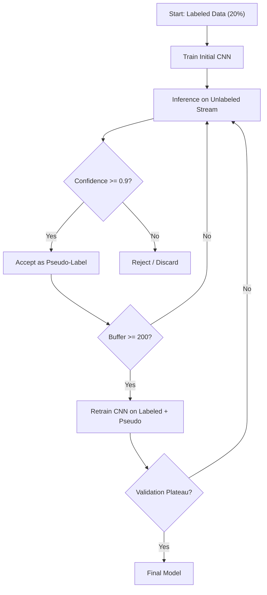

# Figure Specifications for Bachelor Thesis

This document lists every figure referenced in the thesis, with precise instructions for generating or regenerating each one. The goal is a consistent, clean visual style across all figures: minimalist, academic, grayscale with a single accent color (Howest blue: `#004C97`), suitable for both print and digital viewing.

**Recommended tool:** Python + Matplotlib for data plots. SVG vector editor (Inkscape, Figma, or Python with `matplotlib.patches`) for conceptual diagrams. Save all as SVG.

---

## Summary: 10 Figures Total

| # | Caption | File Path | Status | Type |
|---|---------|-----------|--------|------|
| 1.1 | Deployment footprint comparison: Python/PyTorch stack versus Rust single binary | `BachelorProef/thesis/figures/deployment_comparison.svg` | **EXISTS** | Conceptual diagram |
| 2.1 | Flowchart of the implemented pseudo-labeling pipeline | `BachelorProef/thesis/figures/pipeline_flowchart.svg` | **EXISTS** | Conceptual diagram |
| 2.2 | Conceptual comparison of deployment models for Burn, Candle and tch-rs | `BachelorProef/thesis/figures/framework_deployment.svg` | **EXISTS** | Conceptual diagram |
| 2.3 | Conceptual overview of catastrophic forgetting mitigation strategies | `BachelorProef/thesis/figures/forgetting_strategies.svg` | **EXISTS** | Conceptual diagram |
| 3.1 | Accuracy as a function of labeled images per class | `plantvillage_ssl/output/experiments/label_efficiency/label_efficiency_curve.svg` | **EXISTS** | Line chart |
| 3.2 | Bar chart comparison of accuracy at each labeling level | `plantvillage_ssl/output/experiments/label_efficiency/label_efficiency_bars.svg` | **EXISTS** | Bar chart |
| 3.3 | Visual comparison of accuracy metrics between small-base and large-base scenarios | `plantvillage_ssl/output/experiments/class_scaling/class_scaling_comparison.svg` | **EXISTS** | Grouped bar chart |
| 3.4 | New class accuracy as a function of labeled samples, for both base sizes | `plantvillage_ssl/output/experiments/new_class_position/new_class_accuracy_curve.svg` | **EXISTS** | Line chart (dual series) |
| 3.5 | Detailed comparison at 50 labeled samples | `plantvillage_ssl/output/experiments/new_class_position/position_comparison_50.svg` | **EXISTS** | Grouped bar chart |
| 3.6 | Catastrophic forgetting as a function of labeled samples for the new class | `plantvillage_ssl/output/experiments/new_class_position/forgetting_curve.svg` | **EXISTS** | Line chart (dual series) |

---

## Figure 1.1: Deployment Footprint Comparison

**Caption:** Deployment footprint comparison: Python/PyTorch stack versus Rust single binary.

**File:** `BachelorProef/thesis/figures/deployment_comparison.svg`

**Status:** EXISTS

**Description:** A conceptual diagram showing two vertical stacks side by side, representing what needs to be installed on the target device for each deployment model.

**Left stack (Python/PyTorch):**
- A tall vertical stack of 5 rectangular blocks, top to bottom:
  1. "Application code" (small block, ~5% of total height)
  2. "Model weights (~5 MB)" (small block, ~2%)
  3. "TorchVision, NumPy, Pillow" (medium block, ~15%)
  4. "PyTorch + CUDA" (very large block, ~50%)
  5. "Python interpreter" (large block, ~28%)
- Label on the right: "~2-5 GB total"
- Color: light gray fill, dark gray outline.

**Right stack (Rust/Burn):**
- A single compact rectangle labeled "Single binary: 26 MB"
- Inside the rectangle, three smaller stacked sections for illustration:
  - "Application code"
  - "Model weights (~5 MB)"
  - "Burn runtime"
- Color: Howest blue (`#004C97`) fill, white text.

**Below both stacks:**
- A small icon or label indicating the distribution channel:
  - Left: "Requires: Wi-Fi install / Docker / pre-installed environment"
  - Right: "Fits on: USB stick / Bluetooth / brief mobile data"

**Dimensions:** 160mm wide, 100mm tall. Clean sans-serif font (Inter or Helvetica). No gradients.

**Suggested implementation:** Use Inkscape, Figma, or Python `matplotlib.patches.Rectangle` with `plt.text`. Keep it flat and schematic.

---

## Figure 2.1: Pseudo-Labeling Pipeline Flowchart

**Caption:** Flowchart of the implemented pseudo-labeling pipeline.

**File:** `BachelorProef/thesis/figures/pipeline_flowchart.svg`

**Status:** EXISTS

**Note:** This figure is saved as an SVG and referenced directly in `02_research.md`. The Mermaid source is preserved below for reference.

**Mermaid code (already in chapter 2):**

---

## Figure 2.2: Framework Deployment Comparison

**Caption:** Conceptual comparison of deployment models for Burn, Candle and tch-rs.

**File:** `BachelorProef/thesis/figures/framework_deployment.svg`

**Status:** EXISTS

**Description:** A schematic diagram showing three horizontal deployment paths, one per framework.

**Layout:** Three horizontal rows, one per framework:

**Row 1: Burn**
- Left: "Rust source code + model"
- Arrow labeled "cargo build --release"
- Right: Single rectangle labeled "Static binary (CPU/CUDA/WGPU)"
- Bottom annotation: "~26 MB, no runtime deps"
- Color: Howest blue.

**Row 2: Candle**
- Left: "Rust source code + model"
- Arrow labeled "cargo build"
- Right: Two options shown side by side:
  - Rectangle: "Static binary"
  - Rectangle: "WASM module"
- Bottom annotation: "Lightweight, inference-focused"
- Color: medium gray.

**Row 3: tch-rs**
- Left: "Rust source code + model"
- Arrow labeled "cargo build"
- Middle: Rectangle labeled "Rust binary"
- Arrow with dashed line labeled "requires at runtime"
- Right: Large rectangle labeled "LibTorch shared library (~1.5 GB)"
- Bottom annotation: "Full PyTorch compat, large runtime dep"
- Color: light gray.

**Dimensions:** 160mm wide, 110mm tall. Use simple rectangles, arrows and text. Flat design, no shadows.

---

## Figure 2.3: Forgetting Mitigation Strategies

**Caption:** Conceptual overview of the three main families of forgetting mitigation strategies: regularization, rehearsal and architecture modification.

**File:** `BachelorProef/thesis/figures/forgetting_strategies.svg`

**Status:** EXISTS

**Description:** A schematic showing three parallel columns, each representing one strategy family.

**Layout:** Three vertical columns with a title at the top of each.

**Column 1: Regularization**
- Title: "Regularization"
- Icon: A neural network diagram with some connections highlighted in red (penalized).
- Text below:
  - "EWC: protect important weights"
  - "LwF: distil old outputs"
- Visual idea: A weight matrix where certain cells have a "lock" icon on them.

**Column 2: Rehearsal**
- Title: "Rehearsal"
- Icon: A small memory buffer (a stack of image thumbnails) feeding back into the training loop.
- Text below:
  - "Experience Replay: replay old examples"
  - "GEM: constrain gradient updates"
- Visual idea: A loop arrow from a "Memory buffer" box back to the "Training" box.

**Column 3: Architecture**
- Title: "Architecture"
- Icon: A neural network where new columns of neurons are added for each new task.
- Text below:
  - "Progressive Nets: add columns"
  - "PackNet: prune and freeze weights"
- Visual idea: A base network with an extra column attached, connected by lateral lines.

**Bottom of the figure:** A small note: "This project uses plain fine-tuning to measure forgetting directly."

**Dimensions:** 160mm wide, 90mm tall. Use simple shapes and line icons. Flat design, consistent stroke width.

---

## Figure 3.1: Label Efficiency Curve

**Caption:** Accuracy as a function of labeled images per class.

**File:** `plantvillage_ssl/output/experiments/label_efficiency/label_efficiency_curve.svg`

**Status:** EXISTS (but you may want to regenerate for consistent style)

**Data:**

| Images per class | Accuracy (%) |
|:---:|:---:|
| 5 | 34.21 |
| 10 | 36.84 |
| 25 | 57.89 |
| 50 | 72.37 |
| 100 | 85.53 |
| 200 | 88.75 |
| 500 | 94.47 |

**Plot type:** Line chart with markers.

**Visualization instructions:**
- **X-axis:** "Labeled images per class" (log scale recommended, or linear with tick labels at 5, 10, 25, 50, 100, 200, 500). Range: 0 to 550.
- **Y-axis:** "Accuracy (%)". Range: 0 to 100.
- **Line:** Howest blue (`#004C97`), solid, linewidth 2.
- **Markers:** Circles, same color, size 6. Filled.
- **Grid:** Light gray horizontal gridlines only (`#E5E5E5`). No vertical gridlines.
- **Annotations:** Add a vertical dashed line at x=100 with a small label "min viable: 100" pointing to the 85.53% point.
- **Background:** White.
- **Font:** Sans-serif, 10pt for axis labels, 8pt for tick labels.
- **Dimensions:** 120mm wide, 80mm tall.
- **Save:** SVG format.

---

## Figure 3.2: Label Efficiency Bars

**Caption:** Bar chart comparison of accuracy at each labeling level.

**File:** `plantvillage_ssl/output/experiments/label_efficiency/label_efficiency_bars.svg`

**Status:** EXISTS (but you may want to regenerate for consistent style)

**Data:** Same as Figure 3.1.

**Plot type:** Vertical bar chart.

**Visualization instructions:**
- **X-axis:** Categories: 5, 10, 25, 50, 100, 200, 500.
- **Y-axis:** "Accuracy (%)". Range: 0 to 100.
- **Bars:** Howest blue (`#004C97`) fill. No outlines. Width: 0.6 relative.
- **Data labels:** Print the exact percentage on top of each bar (e.g., "34.21%"), rotated 45 degrees if needed, font size 7pt.
- **Grid:** Light gray horizontal gridlines only.
- **Annotations:** Highlight the bar at 100 images per class with a slightly darker shade or a thin black outline to indicate the recommended minimum.
- **Background:** White.
- **Font:** Sans-serif, 10pt axis labels.
- **Dimensions:** 120mm wide, 80mm tall.
- **Save:** SVG format.

---

## Figure 3.3: Class Scaling Comparison

**Caption:** Visual comparison of accuracy metrics between the small-base (5 classes) and large-base (30 classes) incremental learning scenarios.

**File:** `plantvillage_ssl/output/experiments/class_scaling/class_scaling_comparison.svg`

**Status:** EXISTS (but you may want to regenerate for consistent style)

**Data:**

| Metric | 5 → 6 classes | 30 → 31 classes |
|:---|:---:|:---:|
| Base accuracy (before) | 99.83% | 98.76% |
| Base accuracy (after) | 99.62% | 97.50% |
| New class accuracy | 100.00% | 96.98% |
| Overall accuracy | 99.68% | 97.49% |
| Forgetting | 0.21 pp | 1.26 pp |

**Note:** Training time is best left as a text annotation rather than on the same axis, because the scale difference (1,573 s vs 8,359 s) would compress the accuracy bars.

**Plot type:** Grouped bar chart.

**Visualization instructions:**
- **X-axis:** Five metric categories: "Base acc. (before)", "Base acc. (after)", "New class acc.", "Overall acc.", "Forgetting (pp)".
- **Y-axis:** Two separate y-axes or a broken axis:
  - Left axis: 95% to 100.5% for the four accuracy metrics.
  - Right axis: 0 to 1.5 for forgetting in percentage points.
  - Alternatively, use two subplots stacked vertically: top for accuracy, bottom for forgetting. The subplot approach is cleaner.
- **Bars:**
  - Small base (5→6): Howest blue (`#004C97`).
  - Large base (30→31): Light gray (`#B0B0B0`).
- **Data labels:** Show values on top of bars.
- **Annotations:** Add a bracket or annotation between the two forgetting bars with text "6× more forgetting".
- **Bottom text box:** "Training time: 1,573 s (small) vs 8,359 s (large)".
- **Background:** White.
- **Font:** Sans-serif, 10pt.
- **Dimensions:** 140mm wide, 90mm tall.
- **Save:** SVG format.

---

## Figure 3.4: New Class Accuracy Curve

**Caption:** New class accuracy as a function of labeled samples, for both base sizes.

**File:** `plantvillage_ssl/output/experiments/new_class_position/new_class_accuracy_curve.svg`

**Status:** EXISTS (but you may want to regenerate for consistent style)

**Data:**

| Labeled samples | 6th class accuracy | 31st class accuracy |
|:---:|:---:|:---:|
| 5 | 3.62% | 0.00% |
| 10 | 5.11% | 0.17% |
| 25 | 60.03% | 19.66% |
| 50 | 84.27% | 25.62% |
| 100 | 95.16% | 55.10% |

**Plot type:** Dual-series line chart.

**Visualization instructions:**
- **X-axis:** "Labeled samples for new class" (linear scale: 5, 10, 25, 50, 100).
- **Y-axis:** "New class accuracy (%)". Range: 0 to 100.
- **Series 1 (6th class):** Howest blue (`#004C97`), solid line with circles.
- **Series 2 (31st class):** Gray (`#888888`), dashed line with squares.
- **Grid:** Light gray horizontal gridlines only.
- **Annotations:**
  - Add a horizontal dashed line at y=70 with label "70% threshold".
  - Annotate that the 6th class crosses 70% at 50 samples, while the 31st class never reaches it within the tested range.
- **Legend:** Top right or bottom right, clear labels: "6th class (small base)" and "31st class (large base)".
- **Background:** White.
- **Font:** Sans-serif, 10pt.
- **Dimensions:** 120mm wide, 80mm tall.
- **Save:** SVG format.

---

## Figure 3.5: Position Comparison at 50 Samples

**Caption:** Detailed comparison at 50 labeled samples.

**File:** `plantvillage_ssl/output/experiments/new_class_position/position_comparison_50.svg`

**Status:** EXISTS (but you may want to regenerate for consistent style)

**Data at 50 samples only:**

| Metric | 5→6 classes | 30→31 classes |
|:---|:---:|:---:|
| New class accuracy | 84.27% | 25.62% |
| Forgetting | -2.84% | 0.62% |
| Overall accuracy | 92.52% | 88.29% |

**Plot type:** Grouped bar chart, 3 groups of 2 bars.

**Visualization instructions:**
- **X-axis:** Three metrics: "New class accuracy", "Forgetting", "Overall accuracy".
- **Y-axis:** Percentage. Range: -5 to 95.
- **Bars:**
  - 5→6 classes: Howest blue (`#004C97`).
  - 30→31 classes: Light gray (`#B0B0B0`).
- **Data labels:** Exact values on top of each bar.
- **Annotation:** A bracket or arrow between the two "New class accuracy" bars with label "-58.7 pp gap".
- **Background:** White.
- **Font:** Sans-serif, 10pt.
- **Dimensions:** 120mm wide, 80mm tall.
- **Save:** SVG format.

---

## Figure 3.6: Forgetting Curve

**Caption:** Catastrophic forgetting as a function of labeled samples for the new class.

**File:** `plantvillage_ssl/output/experiments/new_class_position/forgetting_curve.svg`

**Status:** EXISTS (but you may want to regenerate for consistent style)

**Data:**

| Labeled samples | 5→6 forgetting (%) | 30→31 forgetting (%) |
|:---:|:---:|:---:|
| 5 | 0.42 | -0.70 |
| 10 | 1.42 | 0.37 |
| 25 | -0.25 | 0.15 |
| 50 | -2.84 | 0.62 |
| 100 | -2.50 | 0.55 |

**Plot type:** Dual-series line chart.

**Visualization instructions:**
- **X-axis:** "Labeled samples for new class" (5, 10, 25, 50, 100).
- **Y-axis:** "Forgetting (percentage points)". Range: -3.5 to 2.0.
- **Series 1 (5→6):** Howest blue (`#004C97`), solid line with circles.
- **Series 2 (30→31):** Gray (`#888888`), dashed line with squares.
- **Zero line:** A prominent horizontal black line at y=0 labeled "no forgetting".
- **Grid:** Light gray horizontal gridlines.
- **Annotations:**
  - Annotate the negative values for the 5→6 series as "implicit regularisation" with small text.
  - Annotate the consistently positive values for 30→31 as "measurable forgetting".
- **Legend:** Top right.
- **Background:** White.
- **Font:** Sans-serif, 10pt.
- **Dimensions:** 120mm wide, 80mm tall.
- **Save:** SVG format.

---

## General Style Guide for All Figures

**Color palette:**
- Primary accent: `#004C97` (Howest blue)
- Secondary: `#888888` (medium gray)
- Tertiary / background: `#B0B0B0` (light gray)
- Grid lines: `#E5E5E5`
- Text: `#333333`
- Background: `#FFFFFF`

**Typography:**
- Font family: sans-serif (Inter, Helvetica, or Arial)
- Axis labels: 10 pt
- Tick labels: 8 pt
- Data labels / annotations: 7-8 pt
- Figure caption font (in thesis, not in image): 10 pt italic

**Dimensions:**
- Standard data plot: 120mm × 80mm
- Wide data plot: 140mm × 90mm
- Conceptual diagram: 160mm × 100mm (or 160mm × 110mm)

**Borders and padding:**
- No outer border on the figure.
- Tight layout, but leave enough padding so labels are not clipped.

**File format:**
- Save all as SVG for crisp scaling in Word and PDF.
- If using matplotlib, use `plt.savefig('filename.svg', format='svg', bbox_inches='tight')`.

---

## Checklist Before Final Submission

- [x] Figure 1.1 created and saved to `BachelorProef/thesis/figures/deployment_comparison.svg`
- [x] Figure 2.1 renders correctly from saved SVG (`BachelorProef/thesis/figures/pipeline_flowchart.svg`)
- [x] Figure 2.2 created and saved to `BachelorProef/thesis/figures/framework_deployment.svg`
- [x] Figure 2.3 created and saved to `BachelorProef/thesis/figures/forgetting_strategies.svg`
- [ ] Figure 3.1 exists at `plantvillage_ssl/output/experiments/label_efficiency/label_efficiency_curve.svg` (regenerate if style is inconsistent)
- [ ] Figure 3.2 exists at `plantvillage_ssl/output/experiments/label_efficiency/label_efficiency_bars.svg` (regenerate if style is inconsistent)
- [ ] Figure 3.3 exists at `plantvillage_ssl/output/experiments/class_scaling/class_scaling_comparison.svg` (regenerate if style is inconsistent)
- [ ] Figure 3.4 exists at `plantvillage_ssl/output/experiments/new_class_position/new_class_accuracy_curve.svg` (regenerate if style is inconsistent)
- [ ] Figure 3.5 exists at `plantvillage_ssl/output/experiments/new_class_position/position_comparison_50.svg` (regenerate if style is inconsistent)
- [ ] Figure 3.6 exists at `plantvillage_ssl/output/experiments/new_class_position/forgetting_curve.svg` (regenerate if style is inconsistent)
- [ ] All figure captions in the markdown are updated to match the final figure numbering
- [ ] All figures are centered and display correctly in the Word build
