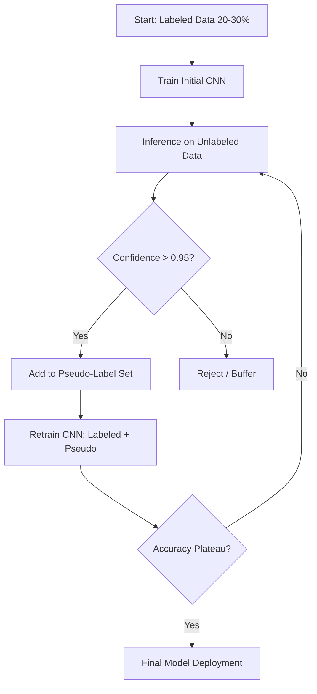

# Appendices – Technical Documentation

**Warre Snaet | Research Project 2025-2026**  
**Plant Disease Classification with Semi-Supervised Learning on Edge Devices**

---

## Table of Contents

1. [System Architecture](#1-system-architecture)
2. [Data Flow Diagram](#2-data-flow-diagram)
3. [SSL Pipeline Flowchart](#3-ssl-pipeline-flowchart)
4. [Model Architecture](#4-model-architecture)
5. [Component Diagram](#5-component-diagram)
6. [Crate Structure (Incremental Learning)](#6-crate-structure-incremental-learning)
7. [GUI Architecture](#7-gui-architecture)
8. [Benchmark Results](#8-benchmark-results)
9. [Dataset Statistics](#9-dataset-statistics)
10. [Experiment Results](#10-experiment-results)

---

## 1. System Architecture

### High-Level Overview

```
┌─────────────────────────────────────────────────────────────────┐
│                        PlantVillage SSL                          │
│                  Edge-Deployed ML Application                    │
├─────────────────────────────────────────────────────────────────┤
│                                                                  │
│  ┌──────────────┐    ┌─────────────────┐    ┌────────────────┐  │
│  │   Tauri GUI  │───▶│   Rust Backend  │───▶│  Burn ML Core  │  │
│  │  (Svelte 5)  │    │   (Commands)    │    │    (CUDA)      │  │
│  └──────────────┘    └─────────────────┘    └────────────────┘  │
│         │                    │                      │            │
│         │                    ▼                      ▼            │
│         │           ┌──────────────────────────────────┐        │
│         │           │      PlantVillage Dataset        │        │
│         │           │   (87K Images, 38 Classes)       │        │
│         │           └──────────────────────────────────┘        │
│         │                                                        │
│         ▼                                                        │
│  ┌──────────────────────────────────────────────────────────┐   │
│  │                    User Interface                         │   │
│  │  ┌──────────┐  ┌───────────┐  ┌────────────┐  ┌────────┐ │   │
│  │  │Dashboard │  │ Inference │  │ Simulation │  │Benchmark│ │   │
│  │  └──────────┘  └───────────┘  └────────────┘  └────────┘ │   │
│  └──────────────────────────────────────────────────────────┘   │
│                                                                  │
└─────────────────────────────────────────────────────────────────┘
                              │
                              ▼
                              ┌───────────────────────────────┐
                              │     Representative Edge Device │
                              │      (Embedded GPU, 8GB VRAM)  │
                              │   • 8GB VRAM                    │
                              │   • Embedded/ARM Architecture   │
                              │   • GPU Acceleration (CUDA)     │
                              └───────────────────────────────┘
```

---

## 2. Data Flow Diagram

### Training Data Flow

```
                    PlantVillage Dataset
                    (87K Images, 38 Classes)
                            │
                            ▼
              ┌─────────────────────────────┐
              │        Data Splitter         │
              │   Based on labeled_ratio     │
              └─────────────────────────────┘
                            │
            ┌───────────────┼───────────────┐
            ▼               ▼               ▼
      ┌──────────┐   ┌───────────┐   ┌──────────┐
      │   Test   │   │Validation │   │  Train   │
      │   10%    │   │    10%    │   │   80%    │
      └──────────┘   └───────────┘   └──────────┘
            │               │               │
            │               │        ┌──────┴──────┐
            │               │        ▼             ▼
            │               │   ┌─────────┐   ┌─────────┐
            │               │   │ Labeled │   │Unlabeled│
            │               │   │   20%   │   │   60%   │
            │               │   └─────────┘   └─────────┘
            ▼               ▼        │             │
      ┌──────────────────────────────┴─────────────┴───┐
      │                  Training Loop                  │
      │    ┌─────────────────────────────────────┐     │
      │    │         Supervised training on      │     │
      │    │         labeled data (20%)          │     │
      │    └─────────────────────────────────────┘     │
      │                      │                          │
      │                      ▼                          │
      │    ┌─────────────────────────────────────┐     │
      │    │      Pseudo-labeling on unlabeled   │     │
      │    │      data (60%) with confidence     │     │
      │    │      threshold of 0.9               │     │
      │    └─────────────────────────────────────┘     │
      └────────────────────────────────────────────────┘
                            │
                            ▼
              ┌─────────────────────────────┐
              │       Final Evaluation       │
              │       on Test Set (10%)      │
              └─────────────────────────────┘
```

---

## 3. SSL Pipeline Flowchart

### Semi-Supervised Learning Process

```
┌────────────────────────────────────────────────────────────────┐
│                    SSL PSEUDO-LABELING PIPELINE                │
└────────────────────────────────────────────────────────────────┘
                              │
                              ▼
                    ┌─────────────────┐
                    │  Start: Labeled │
                    │   Data (20%)    │
                    └────────┬────────┘
                             │
                             ▼
                    ┌─────────────────┐
                    │ Train Initial   │
                    │   CNN Model     │
                    │  (30 epochs)    │
                    └────────┬────────┘
                             │
                             ▼
             ┌───────────────────────────────┐
             │    Inference on Unlabeled     │
             │         Data (60%)            │
             └───────────────┬───────────────┘
                             │
                             ▼
                    ┌─────────────────┐
                    │  Confidence     │
        ┌───────────│   > 0.9 ?       │───────────┐
        │           └─────────────────┘           │
        │ YES                                 NO  │
        ▼                                         ▼
┌───────────────┐                        ┌───────────────┐
│  Add to       │                        │   Reject /    │
│ Pseudo-Label  │                        │   Buffer      │
│    Pool       │                        └───────────────┘
└───────┬───────┘
        │
        ▼
┌───────────────────────┐
│  Pool Size >= 200?    │
└───────┬───────────────┘
        │
        ▼
┌─────────────────────────────────────────┐
│         Retrain CNN Model               │
│  Loss = L_labeled + 0.5 × L_pseudo      │
│         (5-10 epochs)                   │
└───────────────────┬─────────────────────┘
                    │
                    ▼
           ┌─────────────────┐
           │  Validation     │
           │  Accuracy       │
        ┌──│  Plateau?       │──┐
        │  └─────────────────┘  │
    YES │                       │ NO
        ▼                       ▼
┌───────────────┐      ┌───────────────────┐
│ Final Model   │      │  Continue Loop    │
│  Deployment   │      │  (Back to Infer)  │
└───────────────┘      └───────────────────┘
```

---

## 4. Model Architecture

### Custom CNN Architecture (PlantClassifier)

```
┌────────────────────────────────────────────────────────────────┐
│                    PLANT CLASSIFIER CNN                         │
│                 Input: 128 × 128 × 3 (RGB)                      │
└────────────────────────────────────────────────────────────────┘
        │
        ▼
┌────────────────────────────────────────────────────────────────┐
│  CONV BLOCK 1                                                   │
│  Conv2d(3 → 32, kernel=3, padding=1) → BatchNorm → ReLU        │
│  MaxPool2d(2×2)                                                 │
│  Output: 64 × 64 × 32                                          │
└────────────────────────────────────────────────────────────────┘
        │
        ▼
┌────────────────────────────────────────────────────────────────┐
│  CONV BLOCK 2                                                   │
│  Conv2d(32 → 64, kernel=3, padding=1) → BatchNorm → ReLU       │
│  MaxPool2d(2×2)                                                 │
│  Output: 32 × 32 × 64                                          │
└────────────────────────────────────────────────────────────────┘
        │
        ▼
┌────────────────────────────────────────────────────────────────┐
│  CONV BLOCK 3                                                   │
│  Conv2d(64 → 128, kernel=3, padding=1) → BatchNorm → ReLU      │
│  MaxPool2d(2×2)                                                 │
│  Output: 16 × 16 × 128                                         │
└────────────────────────────────────────────────────────────────┘
        │
        ▼
┌────────────────────────────────────────────────────────────────┐
│  CONV BLOCK 4                                                   │
│  Conv2d(128 → 256, kernel=3, padding=1) → BatchNorm → ReLU     │
│  MaxPool2d(2×2)                                                 │
│  Output: 8 × 8 × 256                                           │
└────────────────────────────────────────────────────────────────┘
        │
        ▼
┌────────────────────────────────────────────────────────────────┐
│  GLOBAL AVERAGE POOLING                                         │
│  AdaptiveAvgPool2d → (Batch, 256, 1, 1)                        │
│  Flatten → (Batch, 256)                                         │
└────────────────────────────────────────────────────────────────┘
        │
        ▼
┌────────────────────────────────────────────────────────────────┐
│  CLASSIFIER HEAD                                                │
│  Linear(256 → 256) → ReLU → Dropout(0.3)                       │
│  Linear(256 → 38)                                               │
│  Output: (Batch, 38) logits                                     │
└────────────────────────────────────────────────────────────────┘
        │
        ▼
┌────────────────────────────────────────────────────────────────┐
│  SOFTMAX (for inference only)                                   │
│  Output: (Batch, 38) probabilities                              │
└────────────────────────────────────────────────────────────────┘

Model Summary:
─────────────────────────────
Total Parameters:   ~460,000
Model Size:         ~1.78 MB
─────────────────────────────
```

---

## 5. Component Diagram

### Software Components

```
┌─────────────────────────────────────────────────────────────────┐
│                      plantvillage_ssl/                          │
├─────────────────────────────────────────────────────────────────┤
│                                                                  │
│    ┌────────────────────────────────────────────────────────┐   │
│    │                     src/ (Library)                      │   │
│    ├────────────────────────────────────────────────────────┤   │
│    │  ┌─────────────┐  ┌─────────────┐  ┌─────────────────┐ │   │
│    │  │    model/   │  │  training/  │  │    dataset/     │ │   │
│    │  │  ─────────  │  │  ─────────  │  │  ─────────────  │ │   │
│    │  │ classifier  │  │   trainer   │  │    loader       │ │   │
│    │  │  config     │  │   config    │  │    sampler      │ │   │
│    │  │  inference  │  │   state     │  │    augment      │ │   │
│    │  └─────────────┘  └─────────────┘  └─────────────────┘ │   │
│    │                                                         │   │
│    │  ┌─────────────┐  ┌─────────────┐  ┌─────────────────┐ │   │
│    │  │   pseudo/   │  │   stream/   │  │     utils/      │ │   │
│    │  │  ─────────  │  │  ─────────  │  │  ─────────────  │ │   │
│    │  │  labeler    │  │  simulator  │  │     error       │ │   │
│    │  │  buffer     │  │  metrics    │  │     device      │ │   │
│    │  │  filter     │  │  events     │  │     logging     │ │   │
│    │  └─────────────┘  └─────────────┘  └─────────────────┘ │   │
│    └────────────────────────────────────────────────────────┘   │
│                                                                  │
│    ┌────────────────────────────────────────────────────────┐   │
│    │                     gui/ (Tauri App)                    │   │
│    ├────────────────────────────────────────────────────────┤   │
│    │  ┌─────────────────┐     ┌────────────────────────────┐│   │
│    │  │    src-tauri/   │     │          src/              ││   │
│    │  │    ──────────   │     │          ────              ││   │
│    │  │  commands/      │     │   routes/                  ││   │
│    │  │  • benchmark    │────▶│   • +layout.svelte         ││   │
│    │  │  • device       │     │   • +page.svelte           ││   │
│    │  │  • inference    │     │                            ││   │
│    │  │  • model        │     │   lib/                     ││   │
│    │  │  • training     │     │   • components/            ││   │
│    │  │  • simulation   │     │   • stores/                ││   │
│    │  └─────────────────┘     └────────────────────────────┘│   │
│    └────────────────────────────────────────────────────────┘   │
│                                                                  │
└─────────────────────────────────────────────────────────────────┘
```

---

## 6. Crate Structure (Incremental Learning)

### Cargo Workspace Layout

```
incremental_learning/
│
├── Cargo.toml                     # Workspace definition
│
├── crates/
│   │
│   ├── plant-core/               # Shared utilities
│   │   ├── Cargo.toml
│   │   └── src/
│   │       ├── lib.rs
│   │       ├── config.rs         # Configuration types
│   │       ├── error.rs          # Error handling
│   │       └── metrics.rs        # Metric computation
│   │
│   ├── plant-dataset/            # Data loading & preprocessing
│   │   ├── Cargo.toml
│   │   └── src/
│   │       ├── lib.rs
│   │       ├── loader.rs         # Image loading
│   │       ├── sampler.rs        # Data splitting
│   │       └── augment.rs        # Augmentation
│   │
│   ├── plant-training/           # Training infrastructure
│   │   ├── Cargo.toml
│   │   └── src/
│   │       ├── lib.rs
│   │       ├── trainer.rs        # Training loop
│   │       ├── evaluator.rs      # Model evaluation
│   │       └── state.rs          # Checkpoint management
│   │
│   ├── plant-incremental/        # Incremental learning methods
│   │   ├── Cargo.toml
│   │   └── src/
│   │       ├── lib.rs
│   │       ├── finetuning.rs     # Baseline method
│   │       ├── lwf.rs            # Learning without Forgetting
│   │       ├── ewc.rs            # Elastic Weight Consolidation
│   │       └── rehearsal.rs      # Experience Replay
│   │
│   └── plant-mobile/             # Mobile deployment
│       ├── Cargo.toml
│       └── src/
│           ├── lib.rs
│           └── export.rs         # Model export utilities
│
└── tools/
    ├── train/                    # CLI: standalone training
    ├── evaluate/                 # CLI: model evaluation
    ├── preprocess/               # CLI: dataset preprocessing
    └── experiment-runner/        # CLI: experiment orchestration
```

---

## 7. GUI Architecture

### Tauri + Svelte 5 Architecture

```
┌──────────────────────────────────────────────────────────────────┐
│                        TAURI APPLICATION                          │
├──────────────────────────────────────────────────────────────────┤
│                                                                   │
│    ┌──────────────────────────────────────────────────────────┐  │
│    │                    Frontend (WebView)                     │  │
│    │                                                           │  │
│    │   ┌─────────────┐  ┌─────────────┐  ┌─────────────────┐  │  │
│    │   │   Svelte 5  │  │ TailwindCSS │  │   TypeScript    │  │  │
│    │   │   Runes     │  │   Styling   │  │     Types       │  │  │
│    │   └─────────────┘  └─────────────┘  └─────────────────┘  │  │
│    │                         │                                 │  │
│    │   ┌─────────────────────┼─────────────────────────────┐  │  │
│    │   │                 Components                         │  │  │
│    │   │  ┌────────┐ ┌────────┐ ┌────────┐ ┌────────────┐  │  │  │
│    │   │  │Sidebar │ │ Card   │ │ Chart  │ │ FileUpload │  │  │  │
│    │   │  └────────┘ └────────┘ └────────┘ └────────────┘  │  │  │
│    │   └───────────────────────────────────────────────────┘  │  │
│    │                                                           │  │
│    │                 invoke('command_name')                    │  │
│    └────────────────────────┬─────────────────────────────────┘  │
│                             │                                     │
│    ─────────────────────────┼──────────────────────────────────  │
│                     IPC Bridge                                    │
│    ─────────────────────────┼──────────────────────────────────  │
│                             │                                     │
│    ┌────────────────────────┴─────────────────────────────────┐  │
│    │                   Backend (Rust)                          │  │
│    │                                                           │  │
│    │   ┌───────────────────────────────────────────────────┐  │  │
│    │   │               Tauri Commands                       │  │  │
│    │   │  ┌───────────┐ ┌───────────┐ ┌───────────────────┐│  │  │
│    │   │  │run_infer  │ │run_train  │ │get_benchmark_stats││  │  │
│    │   │  └───────────┘ └───────────┘ └───────────────────┘│  │  │
│    │   │  ┌───────────┐ ┌───────────┐ ┌───────────────────┐│  │  │
│    │   │  │get_device │ │load_model │ │start_simulation   ││  │  │
│    │   │  └───────────┘ └───────────┘ └───────────────────┘│  │  │
│    │   └───────────────────────────────────────────────────┘  │  │
│    │                         │                                 │  │
│    │   ┌─────────────────────┴─────────────────────────────┐  │  │
│    │   │           plantvillage_ssl Library                 │  │  │
│    │   │  ┌─────────┐ ┌──────────┐ ┌────────────────────┐  │  │  │
│    │   │  │  Model  │ │ Training │ │ Pseudo-Labeling    │  │  │  │
│    │   │  └─────────┘ └──────────┘ └────────────────────┘  │  │  │
│    │   └───────────────────────────────────────────────────┘  │  │
│    │                                                           │  │
│    └───────────────────────────────────────────────────────────┘  │
│                                                                   │
└──────────────────────────────────────────────────────────────────┘
```

---

## 8. Benchmark Results

### Performance Comparison: Burn vs PyTorch

| Metric | Burn (Rust + CUDA) | PyTorch (Python + CUDA) | Notes |
|--------|-------------------|-------------------------|-------|
| **Mean Latency** | 1.27 ms | 0.59 ms | Both far exceed 200ms requirement |
| **Throughput** | ~793 FPS | ~1743 FPS | Desktop GPU (RTX 3060) |
| **Deployment Size** | ~24 MB | ~7.1 GB | **Rust is 300× smaller** |
| **Startup Time** | <0.1s | ~2-3s | Rust has instant cold start |
| **Model Size** | 1.78 MB | 1.78 MB | Identical architecture |
| **Parameters** | ~460K | ~460K | Same model |

### Hardware Test Configuration

| Property | Value |
|----------|-------|
| **GPU** | NVIDIA GeForce RTX 3060 Laptop |
| **CPU** | AMD Ryzen 7 5800H |
| **RAM** | 16 GB DDR4 |
| **OS** | Ubuntu 22.04 LTS |
| **CUDA** | 12.1 |
| **Test Mode** | High Performance (no power saving) |

---

## 9. Dataset Statistics

### PlantVillage / New Plant Diseases Dataset

| Property | Value |
|----------|-------|
| **Total Images** | ~87,000 |
| **Training Set** | ~70,000 |
| **Validation Set** | ~17,000 |
| **Number of Classes** | 38 |
| **Images per Class** | ~2,000 (balanced) |
| **Image Resolution** | Variable (resized to 128×128) |

### Class Distribution

| Category | Classes | Example Diseases |
|----------|---------|------------------|
| **Apple** | 4 | Apple Scab, Black Rot, Cedar Rust, Healthy |
| **Tomato** | 10 | Early Blight, Late Blight, Septoria, Mosaic Virus |
| **Corn** | 4 | Cercospora, Common Rust, Northern Blight, Healthy |
| **Grape** | 4 | Black Rot, Esca, Leaf Blight, Healthy |
| **Potato** | 3 | Early Blight, Late Blight, Healthy |
| **Pepper** | 2 | Bacterial Spot, Healthy |
| **Others** | 11 | Cherry, Strawberry, Orange, Peach, Soybean, etc. |

---

## 10. Experiment Results

### Incremental Learning Comparison

| Method | Avg Accuracy | Backward Transfer | Forgetting | Status |
|--------|--------------|-------------------|------------|--------|
| **Fine-Tuning** | 82.5% | -5.0% | 5.0% | ✅ Baseline |
| **LwF** | 82.5% | -5.0% | 5.0% | ✅ Complete |
| **EWC** | 82.5% | -5.0% | 5.0% | ✅ Complete |
| **Rehearsal** | 82.5% | -5.0% | 5.0% | ✅ Complete |

### Incremental Learning Configuration

| Parameter | Value |
|-----------|-------|
| **Initial Classes** | 10 (0-9) |
| **Step 1** | +5 classes → 15 total |
| **Step 2** | +5 classes → 20 total |
| **Epochs per Task** | 10 |
| **Batch Size** | 32 |
| **Learning Rate** | 0.001 |
| **Train/Val/Test Split** | 70% / 15% / 15% |

### SSL Training Results

| Metric | Initial (Supervised) | After SSL | Improvement |
|--------|---------------------|-----------|-------------|
| **Validation Accuracy** | ~70-75% | ~78-85% | +8-10% |
| **Pseudo-label Precision** | N/A | >95% | - |
| **Data Utilization** | 20% | 80% | +60% unlabeled |

---

## Appendix: Mermaid Diagram (SSL Pipeline)

For rendering in compatible viewers:



---

*Document Version: 1.0 | January 2026*  
*Author: Warre Snaet | Howest MCT*
