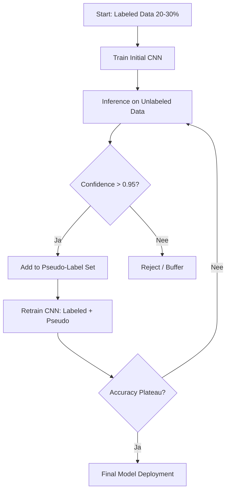

# Literatuurstudie: Semi-Supervised Plant Disease Classification met Burn in Rust op Edge

**Student:** Warre Snaet  
**Opleiding:** MCT – Research Project  
**Datum:** 4 januari 2026

## 1. Inleiding

Deze literatuurstudie vormt de basis voor mijn onderzoek naar het detecteren en classificeren van plantenziekten op edge devices met weinig gelabelde data. In een landbouwcontext is het verkrijgen van grote en correct gelabelde datasets vaak duur en traag. Semi-supervised learning (SSL) biedt hier een praktische oplossing voor. Deze methode combineert een klein gelabeld deel van de data met een grote hoeveelheid ongelabelde data om de prestaties van het model te verbeteren. Een harde eis voor dit project is dat het systeem volledig offline moet kunnen werken. Dit betekent dat het model lokaal draait zonder internetverbinding en zonder gebruik te maken van externe rekenkracht of data-uitwisseling.

Ik kies bewust voor de programmeertaal Rust en het framework Burn. De reden hiervoor is de combinatie van performantie, geheugenveiligheid en de mogelijkheid tot eenvoudige deployment als één statische binary op embedded hardware zoals de NVIDIA Jetson Orin Nano. Deze keuze wijkt af van de klassieke Python en PyTorch stack, maar past beter bij de specifieke vereisten van edge computing zoals lage latency en betrouwbaarheid.

### Onderzoeksvraag
Hoe kan een semi-supervised neuraal netwerk efficiënt worden geïmplementeerd in Rust voor het automatisch labelen van deels gelabelde datasets op een edge device?

### Deelvragen
1. Welke principes en technieken liggen aan de basis van semi-supervised learning en hoe kunnen deze praktisch worden toegepast voor plantziekteclassificatie?
2. Wat is de best practices benadering voor het implementeren van neurale netwerken met behulp van Burn in Rust, inclusief layer-constructie en forward passes?
3. Wat zijn de belangrijkste verschillen in snelheid en accuraatheid tussen Burn, candle_core en tch-rs libraries en welke is optimaal voor edge deployment?
4. Hoe kunnen data-augmentatie en pseudo-labeling strategieën de trainingsefficiëntie verbeteren op gelimiteerde gelabelde datasets?
5. Wat zijn de beste methodes om automatische labels toe te wijzen aan ongelabelde plantbladafbeeldingen en hoe evalueer je de betrouwbaarheid ervan?
6. Hoe kan model-optimalisatie zoals quantization of pruning gebruikt worden om de inference snelheid op de Jetson Orin Nano te verbeteren?
7. Welke afwegingen zijn er te maken tussen model-accuraatheid, inference latency en energieverbruik op edge hardware?
8. Hoe presteert een Burn-gebaseerd semi-supervised model vergeleken met PyTorch equivalenten bij gelijke hardware?
9. Wat zijn praktische implementatiehindernissen bij deployment op edge devices en hoe kunnen deze worden opgelost?
10. Wat is de minimale frequentie van retraining die nodig is om plantziekteclassificatie accuraat te houden in real-world omgevingen?

### SMART-koppeling
*   **Specifiek:** Het doel is semi-supervised classificatie van plantenziekten op de PlantVillage dataset met Rust en Burn. Ik gebruik pseudo-labeling met een eigen CNN. Het systeem werkt volledig offline.
*   **Meetbaar:** De succescriteria zijn de accuraatheid versus een supervised baseline, de inference latency op de Jetson, het aantal en de kwaliteit van de pseudo-labels en de stabiliteit van het systeem. Een strikt criterium is dat er geen netwerkverkeer mag zijn tijdens runtime.
*   **Acceptabel:** De stack moet compatibel zijn met edge devices zonder zware C++ dependencies. Het model moet passen binnen het 8GB VRAM geheugen.
*   **Realistisch:** Ik bouw een eigen licht CNN en gebruik 20 tot 30 procent gelabelde data. Het proces maakt gebruik van iteratieve pseudo-label cycli en eenvoudige augmentaties. Ik gebruik geen Vision Transformers of pretrained modellen.
*   **Tijdgebonden:** Het technisch onderzoek start op 5 januari 2026. Er zijn wekelijkse doelen en evaluatiemomenten vastgelegd in het plan van aanpak.

## 2. Gelijkaardige onderzoeken

In de literatuur zijn diverse methodes beschreven die met weinig labels toch hoge prestaties halen. Hieronder vat ik de belangrijkste samen en geef ik aan wat ik meeneem voor mijn eigen werk.

**Ambiguity-Aware Semi-Supervised Learning (AaSSL)**  
Pham et al. (2025) beschrijven een probleem waarbij foute pseudo-labels het trainingsproces verstoren. Hun methode filtert ambigue samples die dicht bij de decision boundary liggen en wijst deze af in plaats van ze te accepteren. Met slechts 5% gelabelde data steeg de accuraatheid van hun model van 90,74% naar 94,09%.  
*Relevantie:* Ik zal dit concept toepassen door een strikte confidence threshold te gebruiken. Twijfelgevallen komen in een buffer en worden niet direct toegevoegd als pseudo-label.

**Mean Teacher & Consistency Regularization**  
Ilsever & Baz (2024) pakken het probleem van beperkte labels op de PlantVillage dataset aan met een student-teacher model. De gewichten van de teacher zijn een exponentieel voortschrijdend gemiddelde van de student. Ze passen consistency loss toe onder verschillende augmentaties. Dit leverde een accuraatheid op van 88,50% met slechts 5% gelabelde data.  
*Relevantie:* Dit is een sterk concept, maar het vereist dat er twee modellen in het geheugen worden gehouden. Op een device met 8GB VRAM is dit minder ideaal. Ik kies primair voor een lichtere pseudo-labeling aanpak en houd Mean Teacher als alternatief achter de hand.

**Semi-supervised jute leaf disease classification**  
Jannat (2025) richt zich op mobiele en edge deployment met weinig labels. De methode maakt gebruik van een lichtgewicht CNN in combinatie met SSL op 10% gelabelde en 90% ongelabelde data. Dit resulteerde in een accuraatheid van 97,89%.  
*Relevantie:* Dit onderzoek toont aan dat eenvoudige modellen met een goede SSL-aanpak zeer sterk kunnen presteren op edge hardware. Dit bevestigt mijn keuze voor een eigen lichtgewicht CNN.

**Zelf-supervised pretraining**  
Wang et al. (2024) tonen aan dat zelf-supervised pretraining de feature extractors kan verbeteren voor classificatie met weinig labels.  
*Relevantie:* Dit valt buiten de scope van mijn huidige project en dient enkel ter referentie. Ik zal geen zelf-supervised pretraining implementeren.

## 3. Technologievergelijking: Rust ML frameworks

De keuze voor Rust op edge devices wordt gedreven door de mogelijkheid om één statische binary te compileren zonder Python runtime of grote externe C++ dependencies. Dit zorgt voor geheugenveiligheid en een voorspelbare latency.

Hieronder vergelijk ik de drie meest prominente Rust frameworks voor machine learning [14].

**Tabel 1:** Vergelijking van Rust ML frameworks

| Criterium | Burn | Candle | tch-rs |
| :--- | :--- | :--- | :--- |
| **Primaire Focus** | Training & Inference (Flexibel) | Inference (LLM/Serverless) | PyTorch Bindings (Alles) |
| **Backend** | Agnostic (WGPU, CUDA, CPU) | CUDA, CPU, WASM | LibTorch (C++) |
| **Training API** | Uitgebreid, Custom Loops | Beperkter | Volledig (PyTorch-stijl) |
| **Deployment** | Statische Binary | Statische Binary / WASM | Vereist LibTorch DLL/SO |
| **Geschiktheid Edge** | Hoog (Geen zware deps) | Hoog (Lichtgewicht) | Gemiddeld (Complexere cross-compile) |

**Burn** is een puur Rust framework dat backend-agnostic is. Het biedt een uitgebreide training API die zeer geschikt is voor custom loops zoals pseudo-labeling.  
**Candle** is sterk voor inference en focust op LLMs en Transformers. De training API is echter beperkter voor complexe SSL-loops.  
**tch-rs** biedt toegang tot PyTorch via LibTorch bindings. Dit is krachtig, maar zorgt voor een zwaardere deployment en complexere cross-compilatie op ARM-architecturen.

**Conclusie**  
Voor dit onderzoek weegt het voordeel van custom training loops en backend-agnostic deployment zwaarder dan de volledige feature set van PyTorch. Daarom kies ik **Burn** als hoofdframework.

## 4. SSL-pseudo-labeling pipeline

Het doel van de pipeline is om met beperkte gelabelde data toch sterke prestaties te halen via iteratieve pseudo-labeling.

Het proces verloopt in de volgende stappen:
1.  **Start (Supervised):** Ik train een basis CNN op 20 tot 30 procent van de gelabelde data en zet een vaste validatieset op.
2.  **Inference:** Het model doet voorspellingen op de ongelabelde data en berekent de waarschijnlijkheid of confidence per klasse.
3.  **Filtering:** Alleen voorspellingen met een hoge zekerheid (bijvoorbeeld ≥ 0,95) worden bewaard. Alles onder deze drempel gaat naar een reject-buffer.
4.  **Curatie:** De goedgekeurde samples worden toegevoegd als pseudo-labels. Hierbij wordt de bron en de versie van het model gelogd.
5.  **Retraining:** Het model wordt kort getraind (5 tot 10 epochs) met een gecombineerde loss functie. Echte labels krijgen hierbij een gewicht van 1,0 en pseudo-labels een lager gewicht, bijvoorbeeld 0,5.
6.  **Iteratie:** Stappen 2 tot en met 5 worden herhaald. De drempelwaarde kan verhoogd worden om de kwaliteit te bewaken.
7.  **Stopcriteria:** Het proces stopt wanneer de validatie-accuraatheid niet meer stijgt of wanneer nieuwe pseudo-labels geen winst meer opleveren.

**Figuur 1:** Flowchart van de semi-supervised pseudo-labeling pipeline

**Praktische keuzes**  
Ik gebruik lichte en label-consistente augmentaties zoals random crop, resize, horizontale flip en lichte variaties in helderheid. De threshold tuning start bij 0,95 en wordt geëvalueerd op basis van de precisie op de high-confidence set. Ik monitor de pseudo-labels per klasse om onbalans te voorkomen. Indien nodig pas ik oversampling toe of stuur ik de drempel per klasse bij.

De implementatie in Burn maakt gebruik van een generieke modeldefinitie zodat ik lokaal op een NVIDIA GPU kan testen en later op de Jetson kan draaien. De DataLoader wordt multithreaded uitgevoerd om de GPU optimaal te benutten.

## 5. Data pipeline en dataset

Ik maak gebruik van de **PlantVillage** dataset. Deze bevat ongeveer 61.486 afbeeldingen van verschillende gewassen en ziekten. De dataset is goed gedocumenteerd en wordt breed gebruikt in de literatuur.

**Data split**
*   **Labeled subset:** 20 tot 30% van de data wordt gebruikt voor de initiële supervised training.
*   **Unlabeled subset:** 70 tot 80% van de data wordt gebruikt voor pseudo-labeling.
*   **Held-out test set:** Deze set wordt nooit gebruikt tijdens de training en dient enkel voor de finale evaluatie.

**Efficiëntie op edge**  
Het systeem werkt volledig offline. Alle modellen, gewichten en data staan lokaal opgeslagen. Er zijn geen netwerkcalls nodig. Eventuele updates gebeuren via fysieke overdracht. De I/O en preprocessing worden geparallelliseerd. De batch-grootte wordt klein gehouden om VRAM te sparen. Indien nodig worden afbeeldingen verkleind naar een vaste resolutie voor een optimale balans tussen accuraatheid en latency.

## 6. Plan van aanpak

**Week 1: Basismodel en supervised training**  
Ik kies het model (eigen licht CNN) en train de labeled subset. Ik meet de baseline accuraatheid en latency. Ook leg ik de validatieset vast en test ik de augmentaties.

**Week 2: Pseudo-labeling introduceren**  
Ik introduceer de confidence threshold (start 0,95) en de reject-buffer. In de eerste iteratie voeg ik pseudo-labels toe en hertrain ik het model. Ik log de metrics en tune de threshold op basis van de resultaten.

**Week 3: Ablation en stabilisatie**  
Ik vergelijk de resultaten zonder augmentatie, zonder thresholding en zonder pseudo-labels om de impact van elke component te meten. Ook evalueer ik de klassenbalans en stuur ik bij waar nodig.

**Week 4: Edge optimalisatie en deploy**  
Ik kies de definitieve backend (CUDA of WGPU) en test mixed precision indien beschikbaar. Ik meet de latency bij verschillende batchgroottes en log het resourcegebruik. Tot slot voer ik een stress test van 1 uur uit om de stabiliteit te garanderen.

**Validatie**  
*   **Offline validation:** Ik analyseer de training curves en de precisie van de pseudo-labels.
*   **Edge device testing:** Ik deploy het model op de Jetson en log de latency per forward pass.
*   **Semi-supervised validation:** Ik evalueer het model bij verschillende ratio's van pseudo-labels (0%, 25%, 50%, 75%).
*   **Benchmark:** Ik vergelijk mijn model met een vergelijkbare architectuur in PyTorch op dezelfde hardware.
*   **Live demo:** Ik log de voorspellingen en confidence scores en maak een video timelapse van de outputs.

**Succescriteria**  
Het project is geslaagd als de SSL-aanpak beter scoort dan de supervised baseline op de held-out test set. De inference latency moet voldoen aan de edge-eisen, met een indicatief doel van minder dan 200 ms per beeld. Het systeem moet stabiel draaien zonder memory leaks en volledig offline functioneren.

## 7. Discussie

De keuze voor SSL past uitstekend bij de landbouwsector waar gelabelde data schaars is. De eis voor offline werking maakt het systeem robuust en inzetbaar op afgelegen locaties, een aanpak die ook wordt ondersteund door recente ontwikkelingen in Rust-based inference engines voor edge devices [12]. Burn biedt de nodige controle over training en deployment die past bij embedded systemen. Hoewel technieken zoals Mean Teacher en zelf-supervised pretraining nuttig kunnen zijn, beperk ik mij in dit project tot een eigen CNN met pseudo-labeling. Hierbij houd ik rekening met de quantity-quality trade-off zoals beschreven in recente literatuur [13], door te focussen op een strikte confidence threshold om ruis te beperken.

## 8. Conclusie

Semi-supervised learning met pseudo-labeling is een haalbare en efficiënte strategie voor plantenziekteclassificatie met beperkte labels. Door Burn in Rust te gebruiken, kan ik een compacte, performante en betrouwbare pipeline bouwen die geschikt is voor edge devices. De literatuur bevestigt dat het filteren van ambigue samples en het gebruik van consistente augmentaties cruciaal zijn. Mijn plan is iteratief en meetbaar, met duidelijke validatie op zowel desktop als Jetson hardware. Dit vormt een stevig fundament voor het technisch onderzoek dat start op 5 januari 2026.

## 9. Bronvermelding

**Peer-reviewed en formele bronnen**

[1] T. C. Pham, “Ambiguity-aware semi-supervised learning for leaf disease classification,” *Scientific Reports*, vol. 15, no. 1, 2025. Online: https://www.nature.com/articles/s41598-025-95849-3

[2] M. Jannat, “Real-time jute leaf disease classification using an effective deep learning-based semi-supervised learning approach,” *Scientific Reports*, vol. 15, 2025. Online: https://pmc.ncbi.nlm.nih.gov/articles/PMC12592198/

[3] K. P. Singh and P. Gupta, “Semi-supervised learning for plant leaf disease detection,” *Journal of Plant Diseases and Protection*, 2024. Online: https://link.springer.com/journal/41348

[4] E. Ilsever and A. Baz, “Consistency regularization-based semi-supervised learning for plant disease recognition,” *Journal of King Saud University – Computer and Information Sciences*, vol. 36, 2024. Online: https://www.sciencedirect.com/journal/journal-of-king-saud-university-computer-and-information-sciences

[5] W. Wang et al., “Self-supervised learning for plant disease classification with MAE and CBAM,” *Computers and Electronics in Agriculture*, vol. 216, 2024. Online: https://www.sciencedirect.com/journal/computers-and-electronics-in-agriculture

[6] Tracel-AI, “Burn: A Flexible and Modular Tensor Library for Machine Learning in Rust,” *Burn.dev (Documentation)*, 2025. Online: https://burn.dev/docs/burn/

[7] Tracel-AI Contributors, “Burn GitHub Repository,” *GitHub*, 2024. Online: https://github.com/tracel-ai/burn

[8] RantAI, “Deep Learning via Rust: Comparative Analysis of tch-rs and burn,” *DLVR Book*, 2024. Online: https://dlvr.rantai.dev/docs/part-i/chapter-4/

**Aanvullende referenties**

[9] P. Yaw, “Burn: The Future of Deep Learning in Rust,” *Dev.to*, Dec. 2024. Online: https://dev.to/philip_yaw/burn-the-future-of-deep-learning-in-rust-5c5e

[10] Calmops, “Burn: A Modern Deep Learning Framework for Rust,” *Calmops.com*, Dec. 2025. Online: https://calmops.com/programming/rust/burn-framework-rust-ml/

[11] Hamze, “Rust Ecosystem for AI & LLMs,” *HackMD*, Apr. 2025. Online: https://hackmd.io/@Hamze/Hy5LiRV1gg

[12] T. Zhang et al., “MicroFlow: An Efficient Rust-Based Inference Engine for TinyML,” *arXiv preprint arXiv:2409.19432*, 2024. Online: https://arxiv.org/abs/2409.19432

[13] H. Chen et al., “SoftMatch: Addressing the Quantity-Quality Trade-off in Semi-supervised Learning,” in *Proc. Int. Conf. Learn. Represent. (ICLR)*, 2023. Online: https://arxiv.org/abs/2301.10921

[14] MarkAICode, “Rust for Machine Learning in 2025: Framework Comparison and Performance Metrics,” *MarkAICode*, 2025. Online: https://markaicode.com/rust-machine-learning-framework-comparison-2025/